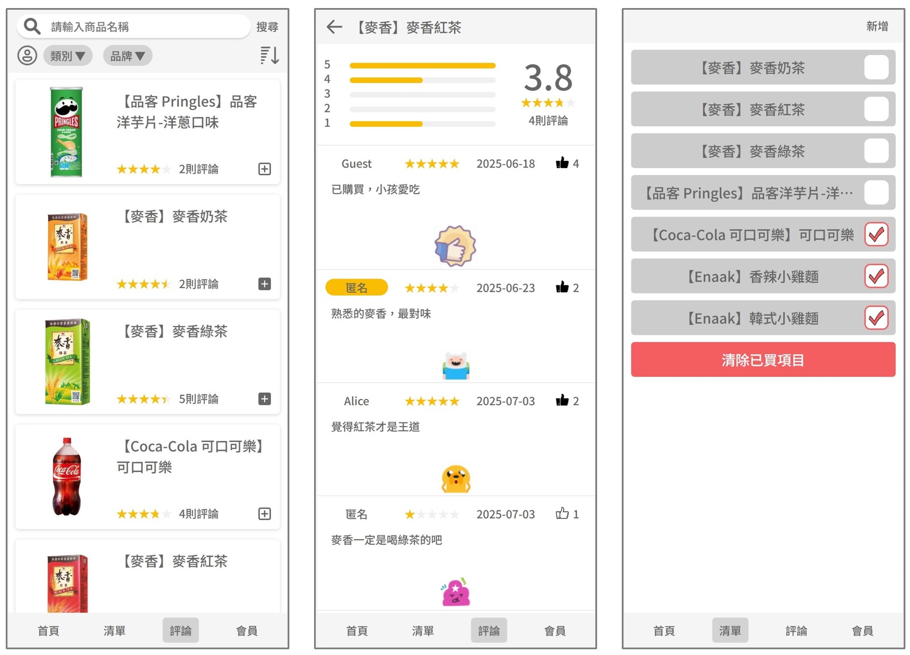
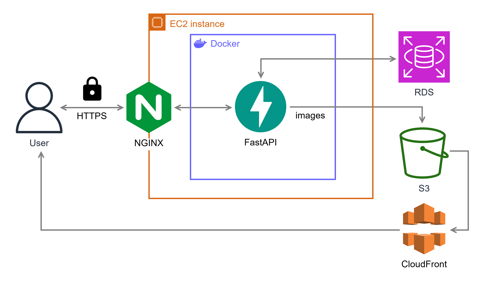
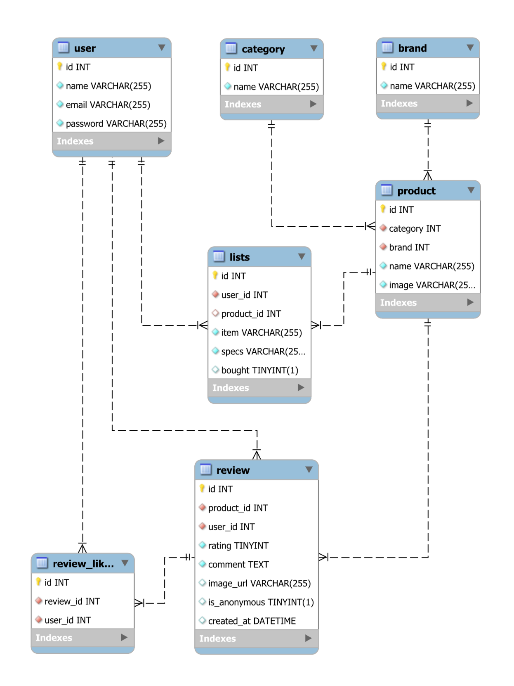

 
 

  

  <strong>一次買夠是一個結合購物清單及評論留言板的小工具</strong>

---

**網站連結**：<a href="https://api.quantumdork.com" target="_blank">https://api.quantumdork.com</a>

**API 文件**：<a href="https://api.quantumdork.com/docs" target="_blank">https://api.quantumdork.com/docs</a>

**原始碼**：<a href="https://github.com/Hamgym/personal" target="_blank">https://github.com/Hamgym/personal</a>

---

## **主要功能**

* 搜尋及建立商品
* 查看及撰寫評論
* 快速建立購物清單

## **雲端架構說明**

* 在部署於 AWS EC2 的 Nginx 上設定 SSL 憑證，讓使用者可以透過 HTTPS 建立安全連線。
* 將 FastAPI 後端應用程式容器化為 Docker 映像檔，以確保開發與部署環境的一致性。
* 使用 AWS RDS 建立 MySQL 資料庫，作為 FastAPI 應用程式的主要資料儲存後端。
* 將使用者上傳的圖片儲存至 AWS S3，享有高擴展性與易於管理的雲端儲存空間。
* 使用 AWS CloudFront 作為內容傳遞網路（CDN），提升使用者存取 S3 中圖片的載入速度與體驗。

## **資料庫結構**

* `user`：儲存使用者帳號、密碼與基本資訊
* `category`：商品分類，例如飲料、餅乾等
* `brand`：商品品牌名稱
* `product`：商品資訊，關聯至 `category` 與 `brand`
* `lists`：使用者的購物清單內容，關聯至 `user` 與 `product`
* `review`：商品的評論與評分，關聯至 `user` 與 `product`
* `review_likes`：使用者對評論的按讚紀錄，關聯至 `user` 與 `review`

